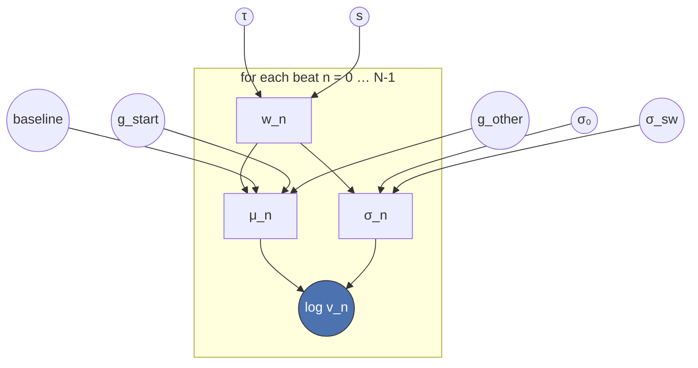

# The switch-detection model: math

*2026-07-10 Roberto Barumerli*

One trial at a time. $n$ indexes beats ($n = 0, 1, 2, \dots, N-1$), and every beat has one
observation: $\log v_n$, the natural-log tap loudness at that beat.

## 1. From loudness in dB to the model's observation

The raw measurement is `rms_db` (decibels). The model works in natural-log amplitude instead,
because that's the scale the original velocity-based change-point model this one is adapted from
was designed around:

$$
\log v_n = \frac{\text{rms\_db}_n}{8.686}
$$

($8.686 = 20/\ln(10)$, the constant that converts dB back to a natural-log scale.) $\log v_n$ is
the **only** quantity the model ever sees — no timing/asynchrony data enters the likelihood.

## 2. The switch weight

Each trial has a switch latency $\tau$ (in beats) and a transition width $s$ (also in beats). At
beat $n$, how far the switch has progressed is:

$$
w_n = \operatorname{sigmoid}\!\left(\frac{n - \tau}{s}\right) = \frac{1}{1 + e^{-(n-\tau)/s}}
$$

$w_n$ goes smoothly from $0$ (still in the old/starting meter) to $1$ (fully in the new meter),
centred on $\tau$. Small $s$ makes this transition sharp (close to a hard step); large $s$ makes
it gradual.

## 3. Two accent templates

Every trial has a **starting meter** ($m_{\text{start}} \in \{2,3\}$ beats per bar) and an
**other meter** $m_{\text{other}}$ (the one it's not). Each meter gets its own accent template: one
expected log-loudness offset per position in the bar, constrained to sum to zero (relative accent,
not an absolute level — the absolute level is `baseline`, below):

$$
g_{\text{start}} = \big(g_{\text{start}}[0], \dots, g_{\text{start}}[m_{\text{start}}-1]\big),
\qquad \sum_i g_{\text{start}}[i] = 0
$$

$$
g_{\text{other}} = \big(g_{\text{other}}[0], \dots, g_{\text{other}}[m_{\text{other}}-1]\big),
\qquad \sum_i g_{\text{other}}[i] = 0
$$

A beat's position within its bar is $n \bmod m$.

## 4. Mean and variance at each beat

The expected log-loudness at beat $n$ blends the two templates by the switch weight, on top of a
shared baseline level:

$$
\mu_n = \text{baseline} + (1-w_n)\, g_{\text{start}}\!\left[n \bmod m_{\text{start}}\right]
       + w_n\, g_{\text{other}}\!\left[n \bmod m_{\text{other}}\right]
$$

Before the switch ($w_n \approx 0$): $\mu_n \approx \text{baseline} + g_{\text{start}}[\cdot]$ —
the starting meter's accent. After the switch ($w_n \approx 1$):
$\mu_n \approx \text{baseline} + g_{\text{other}}[\cdot]$ — the other meter's accent. Right at the
switch, it's a mix of both.

The noise around that mean also depends on $w_n$, inflating right at the switch:

$$
\sigma_n = \sqrt{\sigma_0^2 + \sigma_{sw}^2 \cdot 4\, w_n (1 - w_n)}
$$

$4 w_n (1-w_n)$ peaks at $1$ exactly when $w_n = 0.5$ (the midpoint of the switch) and is $0$ at
either end — so $\sigma_n$ sits at its baseline level $\sigma_0$ far from the switch, and inflates
up to $\sqrt{\sigma_0^2 + \sigma_{sw}^2}$ right at the midpoint.

## 5. Likelihood

Each beat's observed log-loudness is Normally distributed around that mean and variance:

$$
\log v_n \sim \mathcal{N}(\mu_n,\ \sigma_n^2)
$$

and the trial's full likelihood is the product over all beats:

$$
p(\text{data} \mid \tau, s, \text{baseline}, g_{\text{start}}, g_{\text{other}}, \sigma_0, \sigma_{sw})
   = \prod_{n=0}^{N-1} \mathcal{N}\!\left(\log v_n;\ \mu_n,\ \sigma_n^2\right)
$$

## 6. Priors

$$
\tau \sim \mathcal{N}\!\left(\tfrac{N}{2},\ \left(\tfrac{N}{4}\right)^2\right)
$$

$$
\log s \sim \mathcal{N}\!\left(\log 0.15,\ 0.4^2\right)
$$

$$
\text{baseline} \sim \mathcal{N}\!\left(\overline{\log v},\ 2.0^2\right)
$$

$$
g_{\text{start,raw}}[i] \sim \mathcal{N}(0, 1), \qquad
g_{\text{start}} = g_{\text{start,raw}} - \overline{g_{\text{start,raw}}}
$$

$$
g_{\text{other,raw}}[i] \sim \mathcal{N}(0, 1), \qquad
g_{\text{other}} = g_{\text{other,raw}} - \overline{g_{\text{other,raw}}}
$$

$$
\sigma_0 \sim \text{HalfNormal}(0.5), \qquad \sigma_{sw} \sim \text{HalfNormal}(0.5)
$$

| Parameter | Prior | Notes |
|---|---|---|
| $\tau$ | $\mathcal{N}(N/2,\ (N/4)^2)$ | Broad, centred on the trial midpoint — not anchored to the cue time, even for cued trials (see §8). |
| $\log s$ | $\mathcal{N}(\log 0.15,\ 0.4^2)$ | Centred on a *sharp* transition. Checked directly against the data: an instantaneous-switch model beat a gradual one on 18/20 trials, so the prior is shifted to match rather than left at a generic "gradual" default. |
| $\text{baseline}$ | $\mathcal{N}(\overline{\log v},\ 2.0^2)$ | Centred on that trial's own average log-loudness. |
| $g_{\text{start,raw}}, g_{\text{other,raw}}$ | $\mathcal{N}(0,1)$ per position | Made sum-to-zero afterward to get $g_{\text{start}}, g_{\text{other}}$. |
| $\sigma_0$ | $\text{HalfNormal}(0.5)$ | Baseline noise, must be positive. |
| $\sigma_{sw}$ | $\text{HalfNormal}(0.5)$ | Extra switch-related noise, must be positive. |

## 7. Graphical model

Arrows show what each quantity depends on. Circles are the free parameters the model fits
(everything with a prior in §6); the box is repeated once per beat $n$; the shaded node is the
only thing actually observed.

$w_n$, $\mu_n$, $\sigma_n$ are deterministic (no randomness of their own — fully determined by
what points into them); $\log v_n$ is the one random, observed node per beat.

## 8. Cued vs. spontaneous trials

The model is **the same generative model** for both conditions — only how it's used differs:

- **Cued**: $\tau$ still gets the broad, uninformative prior above (not anchored to the cue time).
  This makes recovering the true switch time a genuine test of the likelihood, not something the
  prior guarantees on its own. The fitted $\tau$ is then compared to the known cue time afterward,
  outside the model.
- **Spontaneous**: no cue exists to compare against. The same broad prior is used, and $\tau$'s
  posterior *is* the estimate of when the participant switched on their own. A trial with no real
  switch in the data shows up as a wide, uninformative posterior on $\tau$ rather than a confident
  wrong answer — no separate "did a switch happen" parameter is needed for that.

(An earlier version added a discrete mixture — "switch happened" vs. "no switch, stayed in
$g_{\text{start}}$ the whole trial" — with its own weight $\pi$. It was dropped: mixtures like this
are a known hard case for the sampler, and it caused real convergence failures on trials with weak
signal. The uncertainty it was meant to capture is already visible in how wide $\tau$'s own
posterior gets.)

## 9. Posterior

Combining the likelihood (§5) and priors (§6) via Bayes' rule gives the posterior, with
$\theta = (\tau, s, \text{baseline}, g_{\text{start}}, g_{\text{other}}, \sigma_0, \sigma_{sw})$:

$$
p(\theta \mid \text{data}) \ \propto\ p(\text{data} \mid \theta)\ p(\theta)
$$

This has no closed form, so it's sampled with NUTS (a Hamiltonian Monte Carlo method, via PyMC).
The result is a set of posterior samples for every parameter; $\tau$'s samples are summarised as a
mean and a 94% credible interval, which is what's reported throughout `03_analyse.Rmd`.
